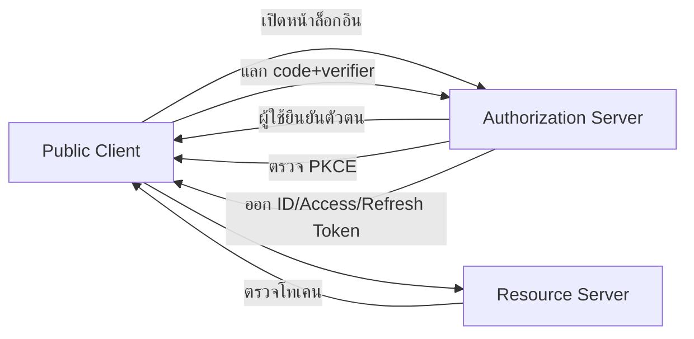

import { Callout } from "fumadocs-ui/components/callout";
import { Steps } from "fumadocs-ui/components/steps";

# Authentication (Auth)

**Authentication (การยืนยันตัวตน)** คือระเบียบวิธีและกลไกทางเทคนิคเพื่อพิสูจน์อัตลักษณ์ของเอนทิตี (ผู้ใช้ อุปกรณ์ กระบวนการ หรือบริการ) ให้มีความเชื่อมั่นเชิงคริปโตและเชิงกระบวนการเพียงพอ ก่อนอนุญาตให้เข้าถึงทรัพยากร ระบบย่อย หรือข้อมูลอ่อนไหว เอกสารชุดนี้จัดระเบียบเนื้อหาเป็น 4 ส่วน **พื้นฐาน**, **สถาปัตยกรรม**, **Best Practices**, และ **Pitfalls**

<Callout>
Authentication (ยืนยันตัวตน) ต่างจาก Authorization (กำหนดสิทธิ์) อย่างแรกตอบคำถามว่า “คุณคือใคร” ส่วนอย่างหลังตอบว่า “คุณทำอะไรได้บ้าง” ทั้งสองมักรวมอยู่ในกรอบ AAA (Authentication, Authorization, Accounting)
</Callout>

---

## พื้นฐาน

### นิยามและขอบเขต

- พิสูจน์อัตลักษณ์ของผู้ร้องขอเข้าถึง (Requester) ด้วยหลักฐาน (Credential) และกลไกตรวจสอบ (Verifier)
- ลดความเสี่ยงจากการแอบอ้าง (Impersonation), การรีเพลย์ (Replay), การดักฟัง (Eavesdropping), และการโจมตีแบบตัวกลาง (MitM)
- ตั้งอยู่บนสมดุล **มั่นคงปลอดภัย (Security)**, **สอดคล้องมาตรฐาน (Compliance)** และ **ประสบการณ์ใช้งาน (UX)**

### ปัจจัยการยืนยันตัวตน (Authentication Factors)

- **สิ่งที่รู้ (Knowledge)** รหัสผ่าน, PIN, คำตอบลับ
- **สิ่งที่มี (Possession)** อุปกรณ์ OTP (TOTP/HOTP), โทเคนฮาร์ดแวร์, Security Key
- **สิ่งที่เป็น (Inherence/Biometrics)** ลายนิ้วมือ, ใบหน้า, ม่านตา, เสียง
- (เสริม) **บริบท/ที่ตั้ง (Context/Location)** และ **พฤติกรรม (Behavioral)**

<Callout type="info">**MFA** คือการใช้ ≥2 ปัจจัยจากคนละหมวดเพื่อยกระดับความมั่นคงปลอดภัย</Callout>

### คุณสมบัติด้านความมั่นคงปลอดภัยที่พึงประสงค์

- **Replay/Phishing Resistance**, **MitM Hardening**, **Rate Limiting/Brute-force Defense**
- **Confidentiality/Integrity** ของ Credential ทั้งขณะส่ง (in transit) และขณะพัก (at rest)
- **Observability** ผ่าน Log/Audit เหตุการณ์สำคัญ (enrollment, login, token refresh, revoke)

### ลำดับเหตุการณ์มาตรฐาน (Diagrams)

```mermaid
sequenceDiagram
  participant U as User
  participant AS as Auth Server
  participant RS as Resource Server
  U->>AS ส่ง Username/Password
  AS-->>U ขอรหัส TOTP (ถ้ามี)
  U->>AS ส่ง TOTP
  AS-->>U ออก Access Token/Session
  U->>RS แนบ Token/คุกกี้
  RS-->>U อนุญาตการเข้าถึง
```



```mermaid
sequenceDiagram
  participant U as User
  participant RP as Relying Party
  participant A as Authenticator
  U->>RP เริ่มลงทะเบียน/ล็อกอิน (WebAuthn)
  RP-->>U ส่ง challenge + params
  U->>A ขอสร้าง/ลงนามกุญแจ
  A-->>U ส่ง public key/ลายเซ็น
  U->>RP ส่งผลกลับ
  RP-->>U ตรวจสอบสำเร็จ
```

---

## สถาปัตยกรรม

### Session‑based (Cookie Session)
- เซิร์ฟเวอร์ถือสถานะเซสชัน ออก **Session ID** ผ่านคุกกี้
- ตั้งค่า **HttpOnly**, **Secure**, **SameSite** และป้องกัน **CSRF**

#### ตัวอย่าง GoFiber – Session‑based + CSRF

```go
package main

import (
  "crypto/subtle"
  "encoding/base64"
  "log"
  "net/http"

  "github.com/gofiber/fiber/v2"
  "github.com/gofiber/fiber/v2/middleware/csrf"
  "github.com/gofiber/fiber/v2/middleware/session"
  "golang.org/x/crypto/argon2"
)

var store = session.New(session.Config{
  CookieHTTPOnly: true,
  CookieSecure:   true,  // เปิดบน HTTPS เท่านั้น
  CookieSameSite: "Lax",
})

// สาธิตการแฮชรหัสผ่านแบบ Argon2id
func hashPassword(password, salt, pepper []byte) string {
  // Argon2id พารามิเตอร์ควรปรับตามทรัพยากรระบบ
  hash := argon2.IDKey(append(password, pepper...), salt, 1, 64*1024, 4, 32)
  return base64.StdEncoding.EncodeToString(hash)
}

func main() {
  app := fiber.New()

  app.Use(csrf.New(csrf.Config{CookieHTTPOnly: true, CookieSameSite: "Lax"}))

  app.Post("/login", func(c *fiber.Ctx) error {
    type req struct{ Username, Password string }
    var r req
    if err := c.BodyParser(&r); err != nil { return fiber.ErrBadRequest }

    // ดึง user จาก DB (สาธิต)
    storedSalt := []byte("random-salt-from-db")
    storedPepper := []byte("system-pepper")
    storedHash := hashPassword([]byte("correct-password"), storedSalt, storedPepper)

    cand := hashPassword([]byte(r.Password), storedSalt, storedPepper)
    if subtle.ConstantTimeCompare([]byte(cand), []byte(storedHash)) != 1 {
      return fiber.ErrUnauthorized
    }

    sess, _ := store.Get(c)
    sess.Set("uid", "user-123")
    if err := sess.Save(); err != nil { return fiber.ErrInternalServerError }

    return c.Status(http.StatusOK).JSON(fiber.Map{"ok": true})
  })

  app.Get("/me", func(c *fiber.Ctx) error {
    sess, _ := store.Get(c)
    if sess.Get("uid") == nil { return fiber.ErrUnauthorized }
    return c.JSON(fiber.Map{"uid": sess.Get("uid")})
  })

  log.Fatal(app.Listen(":8080"))
}
```

### Token‑based (Bearer Token JWT/Opaque)
- โทเคนอายุสั้น + **Refresh Token Rotation**
- เก็บโทเคนในคุกกี้ **HttpOnly** (ลด XSS) หรือเก็บฝั่งไคลเอนต์ด้วยมาตรการ XSS ที่เข้มงวด

#### ตัวอย่าง GoFiber – JWT Access Token + Refresh Rotation

```go
package main

import (
  "time"
  "log"
  "net/http"

  "github.com/gofiber/fiber/v2"
  jwtware "github.com/gofiber/jwt/v3"
  "github.com/golang-jwt/jwt/v5"
)

var jwtSecret = []byte("super-secret")

func newAccessToken(uid string, ttl time.Duration) (string, error) {
  claims := jwt.MapClaims{
    "sub": uid,
    "iat": time.Now().Unix(),
    "exp": time.Now().Add(ttl).Unix(),
    "scope": "api:read",
  }
  token := jwt.NewWithClaims(jwt.SigningMethodHS256, claims)
  return token.SignedString(jwtSecret)
}

func main() {
  app := fiber.New()

  // Login: ออก access + refresh (สาธิตเก็บ refresh ใน HttpOnly cookie)
  app.Post("/login", func(c *fiber.Ctx) error {
    // ตรวจสอบรหัสผ่านแล้วสมมุติว่า uid = user-123
    at, _ := newAccessToken("user-123", 10*time.Minute)
    // refresh token ควรเป็น opaque + เก็บแฮชใน DB (ย่อเพื่อสาธิต)
    rt := "random-refresh-token"

    c.Cookie(&fiber.Cookie{Name: "rt", Value: rt, HTTPOnly: true, Secure: true, SameSite: "Lax", Path: "/"})
    return c.JSON(fiber.Map{"access_token": at})
  })

  // Refresh: หมุนเวียน token (rotation)
  app.Post("/refresh", func(c *fiber.Ctx) error {
    rt := c.Cookies("rt")
    if rt == "" { return fiber.ErrUnauthorized }
    // ตรวจใน DB ว่า rt ยัง valid แล้วทำ rotation: ออก rt ใหม่ + เพิกถอน rt เก่า
    newAT, _ := newAccessToken("user-123", 10*time.Minute)
    newRT := "new-refresh-token"
    c.Cookie(&fiber.Cookie{Name: "rt", Value: newRT, HTTPOnly: true, Secure: true, SameSite: "Lax", Path: "/"})
    return c.JSON(fiber.Map{"access_token": newAT})
  })

  // Middleware ป้องกันเส้นทางที่ต้องการโทเคน
  app.Use("/api", jwtware.New(jwtware.Config{SigningKey: jwtSecret}))
  app.Get("/api/profile", func(c *fiber.Ctx) error {
    return c.JSON(fiber.Map{"ok": true})
  })

  log.Fatal(app.Listen(":8080"))
}
```

<Callout type="warning">ในงานจริง ควรใช้ **opaque refresh token** ที่สุ่มแข็งแรง บันทึกเฉพาะแฮชในฐานข้อมูล พร้อม **revocation list** และ timestamp เพื่อรองรับการเพิกถอน/ตรวจซ้ำ</Callout>

### OAuth 2.0 / OpenID Connect (SSO)
- ใช้ **Authorization Code + PKCE** สำหรับ public client
- บทบาท **Authorization Server/IdP**, **Resource Server (API)**, **Client**
- เน้น **nonce**, **state**, และการจำกัด **redirect URI**

#### โครงร่าง GoFiber (ย่อ)

```go
// เสี้ยวโค้ดแสดงโฟลว์ /login -> redirect ไป IdP, /oidc/callback -> แลก code เป็น token
app.Get("/login", func(c *fiber.Ctx) error {
  // 1) สร้าง state/nonce เก็บในเซสชัน แล้ว redirect ไป IdP authorize endpoint พร้อม code_challenge
  return c.Redirect("https://idp.example.com/authorize?...&code_challenge=...&state=...")
})

app.Get("/oidc/callback", func(c *fiber.Ctx) error {
  // 2) ตรวจสอบ state/nonce, แลก code + code_verifier เป็น ID/Access/Refresh Token
  // 3) ตรวจลายเซ็น/iss/aud/nonce ของ ID Token, ตั้งคุกกี้/โทเคนตามนโยบาย
  return c.Redirect("/dashboard")
})
```

### WebAuthn / FIDO2
- ยืนยันตัวตนด้วยคริปโตคีย์ผูกโดเมน (RP ID) ต้านฟิชชิงได้ดี
- สอดคล้องกับออเธนติคาเตอร์ฮาร์ดแวร์และแพลตฟอร์ม (Security Key/Touch ID/Windows Hello)

---

## Best Practices

- บังคับใช้ **TLS** ทุกเส้นทาง, เปิด **HSTS**, ปิดโปรโตคอล/ซิฟเฟอร์ที่ล้าสมัย
- รหัสผ่าน ความยาวเพียงพอ, ป้องกันการเดา, แฮชด้วย **Argon2id/bcrypt/scrypt** + Salt; ไม่เก็บเป็นข้อความล้วน; อัปเดตพารามิเตอร์เมื่อฮาร์ดแวร์พัฒนา
- เปิดใช้ **MFA** โดยเฉพาะผู้ดูแลและธุรกรรมเสี่ยงสูง
- โทเคน อายุสั้น, **Refresh Rotation**, **Revocation**, จำกัด **scope** ตามหลัก Least Privilege
- คุกกี้ **HttpOnly**, **Secure**, **SameSite** (Lax/Strict ตามบริบท); ป้องกัน **CSRF** และระบุ **CORS** แบบ allow‑list เท่านั้น
- ลดผิวโจมตี **XSS/SQLi/SSRF** ซึ่งนำไปสู่การขโมยโทเคน/เซสชัน
- นโยบาย **Account Lockout / Backoff / Rate Limiting** พร้อมเทเลเมทรีแจ้งเตือน
- ออกแบบ **Account Recovery** ที่แข็งแรง (ยืนยันหลายปัจจัย, ตรวจที่ตั้ง/อุปกรณ์)
- ทำ **Threat Modeling** รายสม่ำเสมอ ทดสอบ **Pwd/Token Leak Drills** และ **Security Review** ก่อนปล่อยใช้งาน

---

## Pitfalls (กรณีผิดพลาดที่พบบ่อย)

- เก็บรหัสผ่านเป็นข้อความล้วน หรือใช้แฮชเร็ว (MD5/SHA‑1) โดยไม่มี Salt/Pepper
- JWT ไม่มีวันหมดอายุที่เหมาะสม หรือบรรจุข้อมูลอ่อนไหวเกินจำเป็น ลงนามด้วยคีย์อ่อนแอ หรือไม่หมุนคีย์
- เก็บโทเคนใน **localStorage** โดยไม่มีมาตรการ **XSS** ที่เข้มงวด
- ใช้คุกกี้แต่ละเลย **CSRF** และกำหนด **CORS** กว้างเกินไป (เช่น `*`)
- ไม่มี **Refresh Rotation/Revocation**, ไม่บันทึกเหตุการณ์ หรือไม่เฝ้าระวังพฤติกรรมผิดปกติ
- ผสมผสาน **Authentication** กับ **Authorization** อย่างสับสน ทำให้ตรวจสิทธิ์ผิดบริบท

---

<Callout type="success">สรุป เลือกสถาปัตยกรรมตามบริบท (เว็บ/โมบาย/ไมโครเซอร์วิส), ผนวก MFA, บริหารวงจรโทเคน/เซสชัน, จัดเก็บรหัสผ่านอย่างถูกต้อง, และเฝ้าระวังอย่างต่อเนื่อง เพื่อให้ได้ทั้งความปลอดภัยและประสบการณ์ใช้งานที่ดี</Callout>
